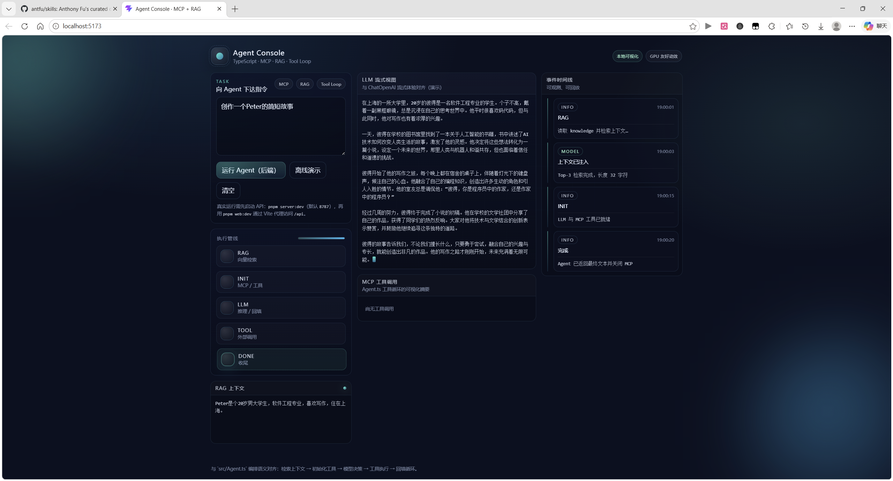

# TS + MCP + RAG Agent Demo

这是一个基于 TypeScript + Node.js ESM 的 Agent 项目，结合了：

- OpenAI 对话模型（流式输出）
- MCP 工具调用（网页抓取、文件系统写入）
- 简易本地向量检索（RAG）
- **Vue 3 控制台**：通过 HTTP + SSE 与 Node 后端实时联动，可视化 RAG / 初始化 / 流式输出 / 工具调用

项目主流程：先对 `knowledge` 目录文档做 embedding 并检索上下文，再把上下文交给 Agent，Agent 根据任务调用 MCP 工具并产出结果文件。

## 功能与特色

- **RAG 检索增强**：将本地知识文档做向量化，按语义检索 TopK 上下文。
- **工具调用能力**：通过 MCP 接入外部工具（如 `mcp-server-fetch`、`@modelcontextprotocol/server-filesystem`）。
- **流式对话输出**：模型响应边生成边打印；Web 端通过 SSE 同步展示 token 与推理片段（若供应商返回）。
- **结构清晰**：`Agent`（编排）、`ChatOpenAI`（LLM 接口）、`MCPClient`（工具客户端）、`EmbeddingRetrievers`（向量检索）。
- **前后端打通**：`src/server.ts` 暴露 `/api/agent/run`（SSE）与 `/api/health`；`web` 在开发模式下通过 Vite 将 `/api` 代理到本机 Node 服务。



## 目录说明

- `src/index.ts`：CLI 入口，负责环境校验、RAG 构建、Agent 执行。
- `src/server.ts`：**HTTP + SSE API**，供 Vue 控制台调用；同一时间仅处理一条 Agent 任务（简单互斥锁）。
- `src/diagnosticLog.ts`：阶段行终端输出 + NDJSON 文件诊断日志（RAG 上下文、embedding 摘要、MCP、LLM 汇总、工具入参/出参、HTTP 任务等）。
- `src/ragContext.ts`：按任务文本构建 RAG 上下文（供 CLI 与 API 复用）。
- `src/Agent.ts`：Agent 主循环，处理工具调用与结果回填；支持可选流式 / 工具钩子。
- `src/ChatOpenAI.ts`：OpenAI Chat Completions 流式调用封装。
- `src/MCPClient.ts`：MCP stdio 客户端封装。
- `src/EmbeddingRetrievers.ts`：embedding 生成与检索逻辑。
- `src/VectorStore.ts`：内存向量库与余弦相似度搜索。
- `web/`：Vue 3 + Vite 前端（Agent Console）。

## 环境要求

- Node.js 18+（建议 20+）
- 可用的 OpenAI 兼容接口（支持 `/chat/completions` 与 `/embeddings`）
- 可执行 `npx`，可选 `uvx`（用于 `mcp-server-fetch`）

## 安装

```bash
pnpm install
pnpm -C web install
```

（使用 npm 亦可：`npm install` 后在 `web` 目录执行 `npm install`。）

## 环境变量配置

在项目根目录创建 `.env`：

```env
OPENAI_API_KEY=your_api_key
OPENAI_BASE_URL=https://your-openai-compatible-endpoint/v1

# 可选：Web API 与模型
AGENT_HTTP_PORT=8787
AGENT_MODEL=gpt-4o-mini
EMBEDDING_MODEL=text-embedding-3-small
RAG_TOP_K=3
# 多个来源时用逗号分隔；默认 *（开发方便）。生产建议收敛为具体前端域名。
AGENT_CORS_ORIGIN=*

# 可选：终端与文件日志（默认写入 logs/agent.log，已 .gitignore）
# minimal：终端只打印 [agent] scope:start|end 阶段行；详情写入日志文件
# full：终端保留原有横幅与流式输出（CLI 默认）
AGENT_TERMINAL=minimal
AGENT_LOG_DIR=logs
AGENT_LOG_FILE=agent.log
# 设为 0 可关闭 NDJSON 文件日志（终端阶段行仍会输出）
AGENT_DIAGNOSTIC_LOG=1
# 设为 1 时把完整 embedding 向量写入日志（文件会很大，默认只写维度与 preview）
AGENT_LOG_EMBEDDING_VECTORS=0
```

### 为何 `pnpm server:dev` 终端“变少”了？

Web API 路径下会为流式回调关闭 `stdout` 的 token 打印（避免与 SSE 重复、刷屏）。**`src/server.ts` 启动时默认将 `AGENT_TERMINAL` 设为 `minimal`**：终端只输出阶段起止行；完整上下文、工具参数/结果、LLM 汇总等写入 **`AGENT_LOG_DIR`/`AGENT_LOG_FILE`**（NDJSON，一行一条 JSON）。CLI `pnpm dev` 未设置时仍为 **`full`**，行为接近早期版本。

## 运行前准备

1. 创建 `knowledge` 目录并放入待检索文本文件（`txt/md/json` 均可按文本读取）。
2. 确认当前机器可以调用 MCP 依赖命令：
   - `uvx mcp-server-fetch`
   - `npx -y @modelcontextprotocol/server-filesystem <output_dir>`

## 运行方式

### 仅 CLI（与原先一致）

```bash
pnpm dev
```

或构建后：

```bash
pnpm build
pnpm start
```

### 全栈：Vue 控制台 + Node API（推荐体验联调）

**终端 1**：启动 API（默认 `http://127.0.0.1:8787`）

```bash
pnpm server:dev
```

**终端 2**：启动前端（`http://localhost:5173`，并把 `/api` 代理到 8787）

```bash
pnpm web:dev
```

在页面中输入任务，点击 **「运行 Agent（后端）」**。**「离线演示」** 不调用后端，仅用于 UI 动画体验。

构建前端静态资源：

```bash
pnpm web:build
```

生产部署时，请将浏览器访问域名下的 **`/api` 路径反向代理**到 `AGENT_HTTP_PORT` 所监听的 Node 服务，并视情况把 `AGENT_CORS_ORIGIN` 设为前端来源（逗号分隔多个值时，服务端会按 `Origin` 匹配允许列表）。

## API 说明

- `GET /api/health`：返回 `{ ok: true, busy: boolean }`，用于健康检查。
- `POST /api/agent/run`：`Content-Type: application/json`，请求体 `{ "task": "..." }`。成功时为 **`text/event-stream`**，每条事件为单行 JSON（`data: {...}\n\n`），主要字段：
  - `type: "phase"`：`phase` 为 `rag` | `init` | `llm` | `tool` | `done`
  - `type: "context"`：检索到的上下文字符串
  - `type: "token"` / `type: "reasoning"`：模型增量输出
  - `type: "tool_call"` / `type: "tool_result"`：携带 `id`（与 OpenAI tool_call id 对齐）与 `name` 等
  - `type: "log"`：结构化日志（供前端时间线）
  - `type: "done"`：`ok` 与可选 `finalText`
  - `type: "error"`：错误信息（随后通常会跟一条 `done: ok=false`）

若已有任务在执行，接口返回 **429**（JSON）。

## 工作流程

1. **RAG 预处理**（`retrieveContextForTask`）
   读取 `knowledge` 文档 -> 调用 embedding 接口 -> 写入内存向量库 -> 按任务语义检索 TopK 上下文。
2. **Agent 初始化**（`Agent.init`）
   初始化 MCP 客户端并收集工具定义 -> 初始化 Chat 模型并注入工具与上下文。
3. **任务执行**（`Agent.invoke`）
   模型输出若包含 tool calls -> 调用对应 MCP 工具 -> 将工具结果回填给模型 -> 直到无工具调用并返回最终文本。
4. **结果落盘**
   通过文件系统 MCP 工具把内容写到 `output` 目录（例如 `output/peter.md`）。

## 常见问题

- **`Missing required environment variable`**  
  检查 `.env` 是否在项目根目录，变量名是否拼写正确。
- **`Embedding request failed`**  
  检查 `OPENAI_BASE_URL`、`OPENAI_API_KEY`、网络连通性、模型名是否可用。
- **`knowledge` 目录不存在或为空**  
  在项目根目录创建 `knowledge`，并放入至少一个文本文件。
- **MCP 工具初始化失败**  
  检查 `uvx`/`npx` 是否可执行，相关包能否下载。
- **前端提示请求失败 / 无法连接 API**  
  确认已启动 `pnpm server:dev`，且端口与 `web/vite.config.ts` 中 `server.proxy['/api'].target` 一致（默认 `8787`）。
- **`Another agent run is in progress`**  
  同一时间仅支持一条后端任务；等待上一条结束后再试。
